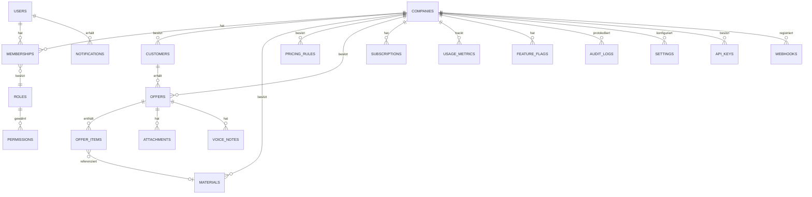

# ARCHITECTURE.md — Angebots-KI für Handwerksbetriebe

> Lebendes Dokument. Wird bei jeder wesentlichen Architekturentscheidung aktualisiert.
> Stand: Meilenstein 0 — Architekturübersicht, Domänenanalyse, Datenmodell, Roadmap.

## 1. Produktvision

Eine modulare, multi-tenant-fähige SaaS-Plattform für Handwerksbetriebe (1–20 Mitarbeiter).
Erstes Modul: KI-gestützte Angebotserstellung. Die Architektur muss so geschnitten sein,
dass CRM, Rechnungen, Baustellenmanagement, Terminplanung, KI-Telefonie usw. **ohne
Neuentwicklung des Kerns** ergänzt werden können.

Leitprinzip für jede Funktion: *Spart sie einem Handwerker mind. 15 Minuten pro Tag?*
Wenn nein → nicht bauen.

---

## 2. High-Level-Architektur

```
┌──────────────────────────────────────────────────────────────────────┐
│                        Vercel Edge / CDN                             │
│  Next.js 15 (App Router) — Server Components + Server Actions        │
└───────────────┬────────────────────────────────────────┬─────────────┘
                │                                          │
        ┌───────▼────────┐                       ┌────────▼─────────┐
        │  Clerk (Auth)   │                       │  Stripe (Billing) │
        │  Org = Company  │                       │  Webhooks         │
        └───────┬────────┘                       └────────┬─────────┘
                │                                          │
┌───────────────▼──────────────────────────────────────────▼───────────┐
│                     Application Layer (server/)                      │
│  Server Actions ─▶ Services ─▶ Repositories ─▶ Drizzle ORM            │
│  Cross-cutting: AuthZ (RBAC), Tenant-Scoping, Zod-Validation,         │
│  Rate-Limiting, Audit-Logging, Feature-Flags/Limits                  │
└───────────────┬───────────────────────────────┬──────────────────────┘
                │                                │
        ┌───────▼────────┐              ┌────────▼─────────┐
        │ Neon Postgres   │              │  OpenAI API       │
        │ (RLS + tenant_id│              │  (Angebotstexte,  │
        │  auf jeder Zeile)│             │   Function Calling)│
        └─────────────────┘              └───────────────────┘
                │
        ┌───────▼────────┐
        │  Vercel Blob    │  Fotos, Sprachnotizen, PDFs
        └─────────────────┘

Querschnitt: Sentry (Errors + Perf) · Resend (E-Mail) · pdf-lib (PDF-Erzeugung)
```

**Kernentscheidungen:**

- **Server-first**: Business­logik ausschließlich in `server/services`, nie in React-Komponenten.
  Server Actions sind dünne Adapter, die Zod validieren und an Services delegieren.
- **Tenant-Isolation doppelt abgesichert**: (a) jede Query läuft über ein Repository, das
  `tenant_id` zwingend erzwingt (kein Repository-Methodenaufruf ohne `tenantId`-Parameter
  möglich — via TypeScript-Typen erzwungen), (b) zusätzlich Postgres Row-Level-Security als
  zweite Verteidigungslinie.
- **Modularität über Features, nicht über Layers**: `features/offers`, `features/customers`,
  `features/billing` usw. sind vertikale Slices. Jedes Feature-Modul kapselt eigene
  Components, Actions, Services, Repositories, Types. Zukünftige Module (Rechnungen,
  Baustellen, CRM) werden als neue Feature-Slices ergänzt, ohne bestehende anzufassen.
- **Integrationen über Adapter/Ports**: Externe Systeme (DATEV, Lexoffice, Google Calendar,
  WhatsApp Business, OCR, Großhändler-APIs) werden nie direkt aus Services aufgerufen,
  sondern über Interfaces in `services/integrations/<name>/port.ts` mit austauschbaren
  Adaptern. So bleibt der Kern unabhängig von konkreten Drittanbietern.
- **KI strikt getrennt von Preislogik**: Die KI beschreibt nur Leistungen (strukturiertes
  JSON via Function Calling); die Preisengine (reiner, deterministischer TypeScript-Code)
  berechnet Preise ausschließlich aus DB-Daten. Keine KI-generierten Zahlen fließen in
  Angebote ein.

### Ordnerstruktur (Monolith, modular geschnitten)

```
app/                        # Next.js App Router (Routing + Layout only)
  (marketing)/
  (auth)/
  (dashboard)/
    offers/
    customers/
    settings/
    billing/
components/                 # Reine UI-Komponenten (shadcn/ui-basiert), keine Businesslogik
features/                   # Vertikale Feature-Slices
  offers/
    components/
    actions.ts
    schemas.ts
  customers/
  pricing/
  billing/
  ai-assistant/
server/                     # Server-only Utilities: Auth-Context, Tenant-Context, RBAC-Guards
services/                   # Businesslogik (rein, testbar, kein React/Next-Import)
  offers/
  pricing/
  billing/
  usage/
  integrations/
    <provider>/port.ts
    <provider>/adapter.ts
repositories/                # DB-Zugriff, tenant-scoped, ein Interface pro Aggregat
db/
  schema/                     # Drizzle Schemas, ein File pro Domäne
  migrations/
  client.ts
lib/                         # Generische Helper (keine Businesslogik)
ai/
  prompts/                   # Versionierte Prompt-Dateien (offer-v1.md, …)
  schemas/                    # JSON-Schemas für Function Calling
  client.ts
emails/                       # React-Email-Templates für Resend
pdf/                          # pdf-lib Layout-Bausteine
auth/                         # Clerk-Wrapper, Session/Org-Mapping
billing/                      # Stripe-Client, Webhook-Handler, Plan-Konfiguration
permissions/                  # RBAC-Definitionen (Rollen × Permissions)
audit/                        # Audit-Log-Service
webhooks/                     # Eingehende Webhooks (Stripe, später WhatsApp etc.)
types/
utils/
config/                       # Env-Validation (Zod), Feature-Flags, Plan-Limits
```

---

## 3. Domänenanalyse (DDD)

### Bounded Contexts

| Context | Verantwortung | Kern-Aggregat |
|---|---|---|
| **Identity & Tenancy** | Companies, Users, Memberships, Rollen | `Company`, `Membership` |
| **CRM (Customers)** | Kundenstammdaten, Ansprechpartner, Historie | `Customer` |
| **Offers** | Angebotserstellung, Positionen, Status-Workflow | `Offer` (Aggregate Root), `OfferItem` |
| **Pricing Engine** | Materialpreise, Arbeitszeiten, Regeln, Steuer/Rabatt-Logik | `PricingRule`, `Material` |
| **AI Assistant** | Leistungsbeschreibung aus Text/Sprachnotiz generieren | (zustandslos, nutzt `Offer`) |
| **Billing & Subscriptions** | Pläne, Limits, Stripe-Sync, Grace Period | `Subscription` |
| **Usage & Audit** | Nutzungszähler, Audit-Trail | `UsageMetric`, `AuditLog` |
| **Files** | Uploads (Fotos, PDF, Sprachnotizen) | `Attachment` |
| **Notifications** | E-Mail/In-App-Benachrichtigungen | `Notification` |

Diese Contexts sind lose gekoppelt über Service-Interfaces (kein gegenseitiger DB-Zugriff
über Repository-Grenzen hinweg). Ein zukünftiges "Baustellenmanagement"-Modul referenziert
`Customer` und `Offer` nur über deren öffentliche Service-APIs.

### Kern-Workflow: Angebot erstellen (mobile-first, ≤3 Klicks)

1. Handwerker wählt Kunde (oder legt neu an) → spricht Sprachnotiz ein oder tippt Stichpunkte.
2. AI Assistant transkribiert/strukturiert die Leistungsbeschreibung als JSON
   (`{ items: [{ description, category, suggestedUnit }] }`) — **keine Preise, keine Zeiten**.
3. Pricing Engine reichert jede Position mit Material, Arbeitszeit, Preis aus den
   Firmen-Preislisten an (DB-Werte, deterministisch).
4. Nutzer prüft/passt Positionen an → PDF wird generiert (pdf-lib) → Versand oder Download.
5. Jede Statusänderung (erstellt, versendet, angenommen, abgelehnt) wird im Audit-Log erfasst
   und im Usage-Tracking gezählt (Plan-Limit-Check vor Schritt 1).

---

## 4. Datenmodell

Alle Tabellen: `id UUID PK`, `tenant_id UUID` (außer `companies` selbst), `created_at`,
`updated_at`, `deleted_at` (Soft Delete), passende Indizes auf `tenant_id` + Fremdschlüssel.



### Tabellenübersicht

| Tabelle | Zweck | Wichtige Felder |
|---|---|---|
| `companies` | Mandant (Tenant Root) | name, slug, address, logo_url, vat_id |
| `users` | Clerk-gespiegelte Benutzer | clerk_user_id, email, name |
| `memberships` | User ↔ Company ↔ Role | user_id, company_id, role_id, status |
| `roles` | Owner/Admin/Büro/Mitarbeiter/Steuerberater | key, label, is_system |
| `permissions` | Granulare Rechte | key (`offers:create`, `billing:manage`, …) |
| `role_permissions` | Join-Tabelle | role_id, permission_id |
| `customers` | Kundenstammdaten | name, contact_person, phone, email, address, notes |
| `offers` | Angebot (Aggregate Root) | customer_id, status, offer_number, total_net, total_gross, valid_until |
| `offer_items` | Positionen | offer_id, description, quantity, unit, unit_price, material_id, source (`ai`/`manual`) |
| `pricing_rules` | Rabatte, Zuschläge, Anfahrt, Entsorgung, Gemeinkosten, Gewinnaufschlag | type, value, conditions (jsonb) |
| `materials` | Materialkatalog + Preise | name, sku, unit, unit_price, supplier_ref |
| `attachments` | Datei-Metadaten (Blob-Referenz) | owner_type, owner_id, blob_url, mime_type, size |
| `voice_notes` | Sprachnotizen-Metadaten | offer_id, blob_url, transcript, duration_s |
| `activity_logs` | leichte Aktivitäts-Timeline (UI) | entity_type, entity_id, actor_id, action |
| `audit_logs` | rechtssichere Audit-Trail | actor_id, action, entity_type, entity_id, metadata (jsonb), ip |
| `subscriptions` | Stripe-Sync | stripe_customer_id, stripe_subscription_id, plan, status, current_period_end |
| `usage_metrics` | Zähler pro Zeitraum | metric_key (`offers_created`, `ai_requests`, …), period, value |
| `feature_flags` | Plan-/Company-Overrides | key, enabled, scope (`plan`/`company`) |
| `settings` | Firmeneinstellungen | key, value (jsonb) — z.B. Briefkopf, MwSt-Satz |
| `api_keys` | zukünftige Partner-API | hashed_key, scopes, last_used_at |
| `webhooks` | ausgehende Webhooks (später) | url, secret, events |
| `notifications` | In-App/E-Mail-Benachrichtigungen | user_id, type, payload, read_at |

Alle FKs `ON DELETE RESTRICT` außer klar kaskadierender Kind-Entitäten (`offer_items` →
`offers` CASCADE). Composite-Index `(tenant_id, created_at)` auf allen häufig gelisteten
Tabellen (`offers`, `customers`, `audit_logs`).

---

## 5. Multi-Tenancy & Sicherheitsmodell

- **Tenant = Company.** Clerk Organization ↔ `companies.id` 1:1 gemappt.
- Jeder Request erhält einen `TenantContext` (aus Clerk-Session abgeleitet, serverseitig
  verifiziert — niemals aus Client-Payload übernommen).
- Repositories erzwingen `tenantId` als Pflichtparameter (Type-Level, kein optionaler Fall).
- Postgres RLS-Policies als zweite Verteidigungslinie (`USING (tenant_id = current_setting('app.tenant_id'))`).
- Rate-Limiting pro Tenant (nicht nur pro IP) gegen Abuse von KI-Requests.
- Secrets ausschließlich in Vercel Environment Variables, Zod-validiert beim Boot
  (`config/env.ts`), niemals im Client-Bundle.

## 6. RBAC-Modell

Rollen: **Owner, Administrator, Büro, Mitarbeiter, Steuerberater** (optional, read-only auf
Finanzdaten). Permissions sind granular (`offers:create`, `offers:delete`, `customers:manage`,
`billing:manage`, `settings:manage`, `users:invite`, …) und rollenbasiert zugewiesen.
**Jede Server Action prüft Permission serverseitig** über einen zentralen Guard
(`requirePermission(tenantId, userId, "offers:create")`) — das Frontend blendet UI nur aus,
verlässt sich aber nie darauf.

## 7. Subscription & Billing

Pläne: Starter, Pro, Business, Enterprise — jeweils mit Limits (Angebote/Monat, KI-Requests/
Monat, Speicher, Mitarbeiter, Uploads). Limits liegen in `config/plans.ts` und werden bei
jeder limitierten Aktion serverseitig gegen `usage_metrics` geprüft, **bevor** die Aktion
ausgeführt wird. Stripe Checkout für Neuabschluss, Customer Portal für Self-Service,
Webhooks für Statuswechsel (inkl. Grace Period bei fehlgeschlagener Zahlung, Proration bei
Up-/Downgrade). Webhook-Handler sind idempotent (Event-ID-Dedupe) mit Retry-Toleranz.

## 8. AI-Architektur

- Prompts liegen versioniert als Markdown in `ai/prompts/offer-v1.md` etc. — nie inline im Code.
- Output ausschließlich über OpenAI Function Calling mit striktem JSON-Schema
  (`ai/schemas/offer-items.schema.json`), validiert zusätzlich mit Zod nach Empfang.
  Kein Regex-Parsing von Freitext.
- Die KI liefert **nur** Leistungsbeschreibungen + Kategorie-Vorschlag. Preis, Zeit, Rabatt,
  MwSt. kommen ausschließlich aus der Pricing Engine (`services/pricing`).

## 9. Priorisierte Roadmap

| Meilenstein | Inhalt | Ergebnis |
|---|---|---|
| **M0** ✅ | Architekturübersicht, Domänenanalyse, Datenmodell, Roadmap | dieses Dokument |
| **M1** | Projekt-Scaffold: Next.js 15 + TS + Tailwind + shadcn/ui, Ordnerstruktur, Env-Validation, Lint/Format, CI-Grundgerüst | lauffähiges leeres Projekt, deploybar auf Vercel |
| **M2** | Datenbank & Auth-Fundament: Neon + Drizzle Schema (alle Tabellen aus Abschn. 4), Migrations, Clerk-Integration inkl. Org-Mapping, Tenant-Context, RBAC-Grundgerüst | Login, Company-Onboarding, leeres Dashboard |
| **M3** | Kundenverwaltung (CRM-Basis) | Kunde anlegen/suchen/bearbeiten, mobile-first |
| **M4** | Preisengine + Materialien/Preislisten (ohne KI) | Angebot manuell erstellbar mit korrekter Preisberechnung |
| **M5** | KI-Assistent für Leistungsbeschreibung (Text + Sprachnotiz) | Angebotsposition aus Diktat, versioniertes Prompt-System |
| **M6** | PDF-Erzeugung & Versand | professionelles Angebots-PDF, Download/E-Mail |
| **M7** | Subscription & Billing (Stripe) inkl. Plan-Limits, Feature-Flags | zahlende Kunden möglich |
| **M8** | Audit-Log, Usage-Tracking, Dashboard-Kennzahlen | Owner sieht Aktivität & Verbrauch |
| **M9** | Security-Härtung, Rate-Limiting, Monitoring (Sentry), E2E-Tests kritischer Flows | Production-Ready-Review |
| **M10+** | Zukünftige Module (Rechnungen, Baustellen, Kalender, KI-Telefonie, Integrationen) | je eigener Feature-Slice, entkoppelt über Adapter |

Jeder Meilenstein wird lauffähig, getestet und deploybar übergeben. Nach jedem Meilenstein
erfolgt eine Freigabe, bevor der nächste startet.

---

**Nächster Schritt (M1) wartet auf Freigabe.**
